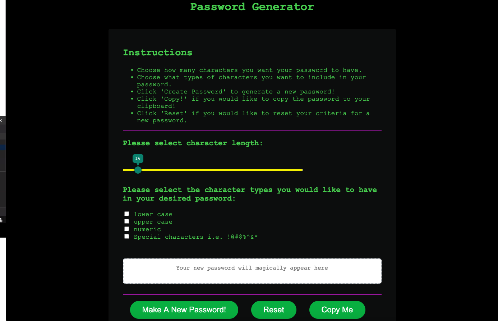

# password-generator

## Features

Page contains:

* Instructions
* Slider that ranges from 8-128 for character length
* Checkboxes for multiple criteria for desired password
* Functioning 'Make A New Password' button to generate a new password
* Functioning 'Reset' button that refreshes the page
* Functioning 'Copy' button to copy generated password onto clipboard

### Acceptance Criteria

* A secure pass word is needed

* Create a click button that will give multiple prompts for password criteria

* First prompt asks for length of password

* Password must be 8 characters minimum, and 128 maximum.

* Second prompt asks which character types to include (lowercase/uppercase/numeric/special characters)

* Password will be generated once prompts are answered, and password will be displayed on the page.